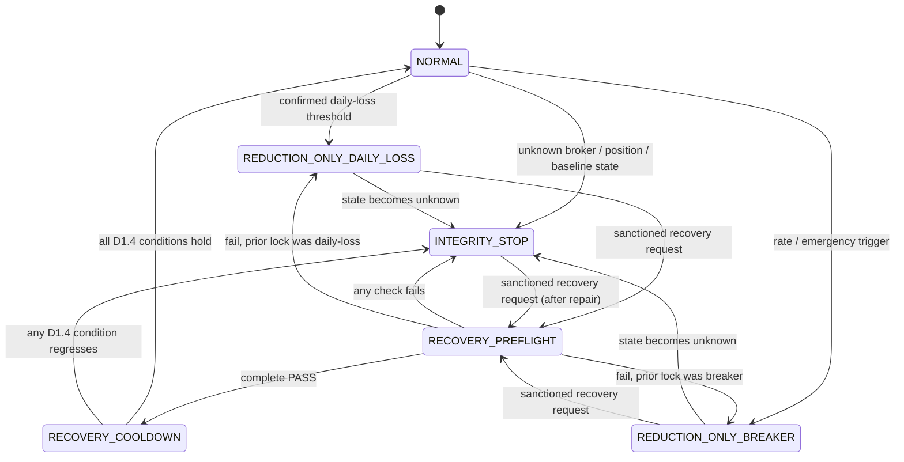

# ADR 0043 — Loss-Control Architecture

| Field | Value |
|---|---|
| Date | 2026-07-20 |
| Status | **Accepted** (owner accepted the v3 architecture 2026-07-20; implementation is future governed work — see "Implementation status") |
| Phase | Cross-phase (risk engine; durable successor to the ADR 0042 fast-track) |
| Supersedes | — (extends ADR 0004 *circuit-breaker-hard-halt* and ADR 0004 *daily-loss-from-start-of-day-baseline*) |
| Related | 0042 (verified risk-reducing orders + decision ledger), 0004 *circuit-breaker-hard-halt*, 0004 *daily-loss-from-start-of-day-baseline*, 0034 (per-account risk containment), 0035 (operational self-healing), 0038 (reducing-exits exempt from gross gate), 0039 (reducing-exits exempt from cooldown) |

> **Implementation status.** This ADR is **accepted architecture, not implemented code.** The decision —
> the state machine, baseline lifecycle, trip taxonomy, recovery preflight, hysteresis policy, schema
> shape, and CI guard — is ratified and governing. Its DDL/migrations, engine wiring, preflight, and
> `check_*` invariant are **future governed work**; the `⟨…⟩` markers below are deliberately unfilled
> implementation-time detail. Acceptance of the architecture does not assert any of it is built or
> canary-verified.

## Context

On 2026-07-13 the daily-loss and circuit-breaker gates blocked the momentum-portfolio book's own
*risk-reducing* sells: under lock the book stayed ~98% invested through a −7% day, and ~36% of the loss
accrued **after** the control fired. (Incident: `docs/incidents/2026-07-13-risk-gate-traps-risk-CLOSED.md`.)

**ADR 0042** was the fast-track remedy — it made the loss controls *non-trapping* by admitting orders the
engine can *verify* reduce risk (classified by projected risk effect, recorded in the `risk_decisions`
ledger). The canary proved the exact failure fixed on live paper (GREEN, non-vacuous, 2026-07-17). ADR
0042 did **not** redesign the control machinery. Four structural weaknesses remain:

1. **The controls are entangled and mis-ordered.** The daily-loss gate (engine step 9) runs before the
   breaker gate (step 13) and both reject unconditionally, so *resetting the breaker did not help* — the
   account was structurally unable to de-risk regardless of breaker state.
2. **The session baseline is not durably persisted.** A restart can re-anchor the start-of-day equity
   baseline and trip the breaker on a trivial move (the spurious-trip class — a ~$24 move once tripped it).
3. **A trip carries no classification.** The system records *that* it tripped, not *why* (real loss vs.
   stale-baseline artifact vs. broker uncertainty), so recovery cannot be reasoned about.
4. **Recovery is a reflexive reset.** No checked procedure confirms a resume is safe; the incident rulings
   forbid reflexive resets precisely because none exists.

This ADR answers: **what is the durable architecture of the loss controls** — how they are separated,
how they share persisted state, how the session baseline persists, how trips are classified, and how
recovery is gated — so the controls constrain risk without trapping the book inside it, without
oscillating around their thresholds, and without ever *claiming* a reduction it cannot verify.

**Relationship to ADR 0042 (orthogonal responsibilities).** ADR 0042 answers *"what orders may pass?"*
(per-order verification + the decision ledger). This ADR answers *"what state is the account in?"* (the
loss-control state machine + baseline + recovery). The two are deliberately orthogonal: 0042 is invoked
*by* this ADR's states (the verified-reduction path in `REDUCTION_ONLY_*`), but it neither owns nor
mutates account state. Keeping the split clean is what makes both ADRs maintainable.

## Decision

Adopt an **account-level loss-control state machine**: the daily-loss control and the circuit breaker
keep **distinct trigger logic** but share **one persisted account-level state machine** and a
**most-restrictive decision-combination layer**, with a persisted immutable session baseline, a
three-field trip classification, a checked recovery preflight with class-dependent authority, and
asymmetric re-arm (no monetary hysteresis band). The ADR 0042 verified-reduction invariant is preserved
and given an explicit epistemic precondition.

### D1 — Control model: distinct triggers, shared state machine

Each control independently emits one of `ALLOW | ALLOW_REDUCTION_ONLY | REFUSE | INTEGRITY_STOP`. The
engine resolves them by a **normative precedence ladder** (this is the precise meaning of
"most-restrictive" here — it is a fixed ordering, not a subjective judgement):

```
INTEGRITY_STOP  >  ALLOW_REDUCTION_ONLY  >  REFUSE  >  ALLOW
```

Evaluate top-down; the first matching rung is the combined outcome:

| Precedence | Condition | Combined outcome |
|---|---|---|
| 1 (highest) | Unknown / reconciliation-failed position or baseline state | `INTEGRITY_STOP` |
| 2 | Verified reduction **with known state** | `ALLOW_REDUCTION_ONLY` |
| 3 | Any control refuses a risk increase | `REFUSE` |
| 4 (lowest) | none of the above | `ALLOW` |

The one deliberate non-monotonicity: `ALLOW_REDUCTION_ONLY` ranks **above** `REFUSE`, because a verified
reduction under a lock must pass (the ADR 0042 invariant) — but only rung 1 can override it, since a
reduction cannot be *verified* under unknown state (D2). This ladder is **normative**: an implementation
that resolves combined outcomes any other way is non-conforming.

There is **no numbered gate sequence** where "step 9" can shadow "step 13".

**D1.1 — The state machine is authoritative.** State is a single persisted account-level machine, not
independent booleans (`daily_loss_locked` + `breaker_tripped` can combine ambiguously). **Controls emit
transition *requests*; only the state machine persists transitions.** No control, engine step, or
recovery tool may mutate account loss-control state directly — a direct write is a non-conforming bug.

**D1.2 — Deterministic event ordering.** Near-simultaneous events (broker disconnect, loss threshold
breach, manual halt, restart) are resolved deterministically: control events are **serialized and
ordered by a monotonic per-account sequence number**; each state transition is **atomic**; and a later
event always observes the state resulting from all earlier-sequenced events. Two conforming
implementations must reach the same terminal state from the same event set.

**D1.3 — The state machine is versioned.** `LOSS_CONTROL_STATE_VERSION = 1` is recorded on the
materialized current-state record and on each `risk_control_events` row (alongside `control_version`), so
future state-model migrations are managed the way policy (`RISK_POLICY_VERSION`) and the ledger already
are.

States:



Transitions are event-driven and persisted (D6).

**D1.4 — `RECOVERY_COOLDOWN → NORMAL` is fully specified** (no subjective "continuous health"). The
transition fires **only** when *all* of the following hold — otherwise the account stays in cooldown, or
regresses to `INTEGRITY_STOP` if a condition fails outright:

- healthy **continuously for the full dwell period** (D6), AND
- **no integrity alerts** active, AND
- **broker reconciliation clean** (positions and open orders match, including externally submitted
  broker orders), AND
- **state unchanged** since the cooldown began (no new trip event was enqueued during dwell).

The two controls own different concerns:

- **Daily-loss control** — purpose: prevent *new* risk once the account exceeds its configured
  start-of-session loss limit. Risk-increasing → REFUSE; risk-neutral → REFUSE by default; verified
  risk-reducing (known state) → ALLOW. It does **not** own infrastructure-health, broker-state, or
  loss-rate concerns.
- **Circuit breaker** — purpose: hard halt when account state, execution state, loss velocity, or
  control integrity indicates ordinary trading is unsafe. Triggers: `LOSS_RATE`,
  `BROKER_STATE_UNCERTAIN`, `POSITION_RECONCILIATION_FAILED`, `BASELINE_INVALID`,
  `CONTROL_INTEGRITY_FAILURE`, `MANUAL_EMERGENCY`. Risk-increasing/neutral → REFUSE; verified
  risk-reducing (known state) → ALLOW; administrative reset → REFUSE until preflight passes.

**D1.5 — "Reduction-only" is exact.** In `REDUCTION_ONLY_DAILY_LOSS` and `REDUCTION_ONLY_BREAKER`, the
account admits **only verified risk-reducing orders under known state**. **Risk-neutral orders are
refused** (not merely "not increasing") — the exemption is for *reductions*, not for anything that fails
to increase risk. Risk-increasing orders are refused. This is normative, not implied.

### D2 — Epistemic precondition on the ADR 0042 invariant (architectural correction)

The verified-reduction exemption applies **only when broker positions, pending orders, and projected
post-trade exposure are known well enough to verify reduction**. When state is uncertain, the engine
returns `INTEGRITY_STOP: REDUCTION_NOT_VERIFIABLE` — it must **not** falsely classify an order as
reducing. This does not weaken ADR 0042; it states the epistemic requirement its verification already
implies (ADR 0042 §A snapshot causality is the mechanism). If broker positions cannot be reconciled, the
engine may not claim ADR 0042 protection applies.

### D3 — Persisted session baseline

The database is the **authoritative** baseline store (not process memory, not a cache alone, not a
reconstructed broker snapshot). One immutable baseline per account per session:

- Session = U.S. equities official **trading date** in `America/New_York`.
- Baseline capture = the **last reconciled account equity immediately before the first sanctioned
  strategy activity for that session** (not "9:30 a.m." — the service may restart after the open or
  start before the broker finalizes balances).
- **Startup rule:** valid baseline exists → reuse exactly. No baseline **and no session activity** →
  reconcile broker state, persist baseline, then permit trading. No baseline **but** orders/fills/position
  changes already occurred → `INTEGRITY_STOP: SESSION_BASELINE_MISSING_AFTER_ACTIVITY`. The system must
  **never** create a mid-session replacement baseline.
- **AWS restart behavior:** the scheduled restart (~06:04 ET factor-refresh) must not create or replace a
  baseline; restarted services only load and verify it.
- **Database unavailable at session start:** if the baseline store cannot be read/written, the account
  does not enter NORMAL — it holds in a no-new-risk state until the store is available (fail-closed).

### D4 — Trip classification (three fields)

Every trip records three separate fields plus evidence pointers:

- **`trip_type`**: `DAILY_LOSS | CIRCUIT_BREAKER | MANUAL_HALT | CONTROL_INTEGRITY`.
- **`trip_cause`**: `REALIZED_AND_MARK_TO_MARKET_LOSS | LOSS_VELOCITY | BROKER_STATE_UNCERTAIN |
  POSITION_RECONCILIATION_FAILED | SESSION_BASELINE_MISSING | SESSION_BASELINE_MISMATCH |
  STALE_MARKET_DATA | ORDER_STATE_UNCERTAIN | CONTROL_CONFIGURATION_INVALID | OPERATOR_EMERGENCY |
  UNKNOWN`.
- **`trip_evidence_status`**: `CONFIRMED | SUSPECTED | ARTIFACT_CONFIRMED | UNRESOLVED`.

`MANUAL` is a `trip_type`/initiator, **not** a cause. `CONCENTRATION_EVENT` is **excluded** — this
taxonomy identifies the loss-control trigger, not portfolio-risk attribution (scope boundary). Also
record: `trigger_value`, `threshold_value`, `baseline_id`, `equity_snapshot_id`,
`positions_snapshot_id`, `orders_snapshot_id`, `control_version`, `decision_ledger_id`.

### D5 — Recovery preflight and authority

**Recovery is not "trading resumes."** A successful recovery authorizes exactly one transition —
`REDUCTION_ONLY_* | INTEGRITY_STOP → RECOVERY_PREFLIGHT → RECOVERY_COOLDOWN`. Re-entry to `NORMAL` (new
risk permitted) happens only later, when the D1.4 conditions hold. "Recovery" grants the *cooldown*, not
the book.

**Recovery requests are idempotent.** A request carries `preflight_id`, `state_version`,
`requested_transition`, and the expected current state; a duplicate or replayed request (e.g. a REST
retry) that names an already-consumed `preflight_id` or a stale `state_version` is **ignored**, not
re-applied. A stale preflight cannot authorize a later reset.

Resuming requires an **automated preflight** whose result is immutable (`PREFLIGHT_PASS |
PREFLIGHT_FAIL | PREFLIGHT_INCOMPLETE`), every check + evidence recorded individually. Checks:

1. Governing configuration identity matches the deployed engine.
2. Broker account reachable.
3. Broker positions reconcile **exactly** with internal positions.
4. Open orders reconcile exactly (including externally submitted broker orders — see Out of scope note).
5. No unknown, duplicate, or in-flight order state.
6. Current session baseline exists and is immutable.
7. Baseline source and broker snapshot valid.
8. Current equity and loss recomputed from authoritative data.
9. Trip cause classified.
10. All verified risk-reducing orders remain enabled.
11. No control-integrity stop remains active.
12. Proposed post-reset permissions explicitly shown.

**Authority by trip class:**

| Trip class | Recovery authority |
|---|---|
| `ARTIFACT_CONFIRMED` (e.g. baseline artifact) | Automated self-heal (ADR 0035) may clear **after full preflight PASS**, with a durable audit event |
| `REAL_LOSS` / `LOSS_VELOCITY` | **Human approval required** — ADR 0035 self-heal may **not** auto-resume |
| `BROKER_STATE_UNCERTAIN` / `POSITION_RECONCILIATION_FAILED` / `CONTROL_INTEGRITY_FAILURE` | No reset until the underlying condition is **repaired**; human approval alone is insufficient |
| `MANUAL_EMERGENCY` | Same authority that initiated the halt, or a designated higher role |

**Authority is not an override.** Human approval authorizes a transition **only on a `PREFLIGHT_PASS`**.
It does not permit resuming past a `PREFLIGHT_FAIL` / `PREFLIGHT_INCOMPLETE` or a live integrity
condition — no role can approve around a failed check. For `BROKER_STATE_UNCERTAIN` /
`POSITION_RECONCILIATION_FAILED` / `CONTROL_INTEGRITY_FAILURE`, the underlying condition must be
*repaired* (which flips the check to PASS); approval alone is insufficient. This is the exact bypass
pattern the incident exposed, stated as a rule.

### D6 — Hysteresis and re-arm

**No symmetric monetary band** ("trip at X, reset at X − ε"): a small mark-to-market improvement does not
prove the loss recovered safely.

- **Daily-loss control:** once tripped, **reduction-only for the rest of the session; no automatic
  same-session re-arm for new risk.** (Simpler and safer than a dollar band.)
- **Circuit breaker minimum dwell:** 15 min (artifact-class), 30 min (rate/velocity), **until next
  session** (confirmed daily-loss), **until manual repair completes** (integrity). After reset, a
  re-arm cooldown: first 15 min reductions allowed / new risk disabled; then new risk only if all
  preflight conditions remain healthy.
- **Loss velocity:** separate trip and recovery thresholds — e.g. trip at the configured velocity limit;
  "healthy" = ≤ 50% of that velocity sustained ≥ 10 min.

## Rationale

- **Why a shared state machine rather than fully separate controls (v1) or a single unified control?**
  The 07-13 failure was two independent concerns implemented as two unconditional gates that each trap
  the book; re-ordering fixes nothing. But *fully* separate controls with independent booleans produce
  ambiguous combined states. The middle path — distinct trigger logic, one persisted state machine, one
  most-restrictive combination layer — keeps each control's reasoning local while making the *combined*
  account state single-valued and auditable.
- **Why the epistemic qualifier (D2)?** "Never block a verified reduction" is only sound if "verified"
  means what it says. Without D2, an engine that has lost sight of broker state could label an order
  reducing and admit it against a phantom position — reintroducing the failure class from the other
  direction. Fail-closed to `REDUCTION_NOT_VERIFIABLE` is the safe resolution.
- **Why DB-authoritative, immutable-within-session baseline (D3)?** The spurious-trip bug is precisely
  recompute-on-restart. A baseline must be a *contemporaneously persisted session fact*, not derived from
  whatever `last_equity` holds at restart. Immutability + the "missing-after-activity → INTEGRITY_STOP"
  rule prevent a restart from silently minting a favourable mid-session baseline.
- **Why three classification fields (D4)?** A reset is a decision that needs evidence. Collapsing cause,
  type, and evidence-quality into one field is exactly why "reset the breaker" was previously
  indistinguishable between a real loss and an artifact. Separating them lets D5 route authority by
  evidence quality.
- **Why class-dependent recovery authority (D5)?** Not all trips are equal: an artifact trip that fully
  passes preflight is safe to auto-clear; a real-loss trip is an owner decision; a broker-uncertain trip
  cannot be "approved" away — it must be repaired. Auto-resuming a real-loss trip via ADR 0035 would
  recreate the reflexive-reset the incident forbade.
- **Why asymmetric re-arm, not a band (D6)?** Loss does not recover safely merely because the mark ticks
  up. Reduction-only-for-the-session is both simpler and strictly safer than tuning a monetary band, and
  it removes the oscillation seen in the acct-3 canary audit trail.
- **Trade-offs accepted:** DB availability becomes part of the trading safety boundary; strict
  reconciliation can delay recovery during broker/API degradation; append-only evidence grows storage;
  and conservative artifact-classification defaults will sometimes route an artifact trip to a human.
  These are the safe directions, but they are real costs (see Consequences).

## Implementation notes

- **Engine.** Restructure `apps/backend/app/risk/engine.py` so the daily-loss and breaker checks no
  longer reject unconditionally in a fixed step order; each control emits `ALLOW |
  ALLOW_REDUCTION_ONLY | REFUSE | INTEGRITY_STOP` and the combination layer applies D1's precedence.
  Reuse ADR 0042's `risk_effect.classify()` / `RiskDecisionService` for the verified-reduction path and
  its §A causal snapshot for D2 (`REDUCTION_NOT_VERIFIABLE` maps onto ADR 0042's INDETERMINATE/fail-closed
  results). Account state read/written via the state machine (D6), not ad-hoc booleans.
- **Schema — append-only events + materialized current-state.** ⟨DDL + Alembic migrations to be authored;
  reviewed per CLAUDE.md migration convention. Extends the ADR 0042 chain, current head
  `a4c7e1f9d2b8`.⟩
  - `risk_session_baselines` — `account_id, market_session_date, session_timezone, baseline_equity,
    baseline_source, captured_at, broker_snapshot_id, status, created_by, superseded_by`;
    **UNIQUE(account_id, market_session_date)** (baseline creation transactionally unique).
  - `risk_control_events` (append-only) — `event_id, account_id, session_date, control_type,
    previous_state, new_state, trip_type, trip_cause, evidence_status, trigger_value, threshold_value,
    baseline_id, broker_snapshot_id, positions_snapshot_hash, orders_snapshot_hash, initiator_type,
    initiator_id, created_at, engine_commit, config_hash`.
  - `risk_recovery_preflights` + `risk_recovery_preflight_checks` — the immutable preflight result and
    its individual checks + evidence.
  - A **materialized current-state** record per account (the state-machine state), projected from the
    event log.
  - **`accounts.circuit_breaker_tripped_at` is demoted to a compatibility projection**, not the governing
    source. Existing readers keep working; the state machine governs.
  - **Projections are derived, never authoritative.** A *projection* is a read-optimized view
    regenerable in full from the append-only `risk_control_events` log (the materialized current-state
    record and `circuit_breaker_tripped_at` are both projections). The event log is the single source of
    truth. **Nothing may write directly to a projection** to change state — projections are produced
    *from* transitions, never the origin of one (this is the D1.1 rule applied to storage). If a
    projection and the event log disagree, the projection is rebuilt from the log.
- **CI invariant (required).** Enforce: *every loss-control refusal path must pass through the
  projected-risk-effect classifier before refusing a known-state order* — the guardrail ADR 0004's halt
  semantics lacked (documented but unenforced for months). ⟨`check_*` script + guard module.⟩
- **Tests (at minimum):** daily-loss and breaker tripped simultaneously; reduction permitted under both;
  risk increase rejected under either; restart reloads the original baseline; restart cannot create a
  replacement baseline after activity; missing baseline after a fill → integrity stop; artifact trip
  cannot be relabeled real-loss without an event; real-loss trip cannot auto-reset; preflight fails on one
  unmatched broker order; preflight fails on one unmatched share; recovery cooldown re-trips safely;
  unknown position state prevents "verified reduction" classification; concurrent reset requests
  idempotent; stale preflight cannot authorize a later reset; baseline creation transactionally unique.
- **Defaults conservative** (house convention): dwell/cooldown/preflight strictness default tight;
  loosenable by config.
- **Canary/test vehicle.** Acct-3 (Conservative, user 3) is held as the ADR-0042 canary rig
  (`acct3_canary_artifact_state` memory). This ADR's verification may reuse it; if so keep acct-3 frozen
  until the 0043 canary runs, then reclaim.

## Consequences

- **Positive.** The exact 07-13 trap cannot recur by construction; spurious restart trips are eliminated;
  a reset becomes an evidenced, authority-gated decision; oscillation is removed; the combined account
  state is single-valued and auditable; and D2 closes the "false reduction under uncertainty" gap.
- **Negative.**
  - **Database availability becomes part of the trading safety boundary** — the store must be up to
    establish a baseline or recover.
  - **Incorrect persisted state may block trading for an entire session** (immutable baseline + no
    mid-session replacement is deliberately unforgiving).
  - **Strict reconciliation can delay recovery** during broker/API degradation.
  - **Append-only evidence increases storage and retention requirements** (compounds ADR 0042's ledger
    growth — a retention policy is owed across both).
  - **Automated artifact classification can be wrong**, so it needs conservative defaults and routes to a
    human when evidence is not `ARTIFACT_CONFIRMED`.
  - **Recovery now requires operator training and incident drills** — a checked preflight is only as good
    as the operators who run it under pressure.
- **Neutral.** The breaker's hard-halt intent (ADR 0004) is preserved; this ADR changes *how* the halt is
  evaluated, combined, and recovered — not *that* a hard halt exists.

## Alternatives considered (not chosen)

1. **Leave ADR 0042 as the whole fix.** Rejected: 0042 is a patch that makes controls non-trapping but
   leaves entanglement, a volatile baseline, and reflexive recovery intact. The spurious-trip class
   already recurred.
2. **Recalibrate thresholds** (raise daily-loss cap / widen breaker). Rejected on owner ruling — an
   audited parameter change to defeat an active protection is functionally a bypass; also addresses none
   of baseline/recovery/oscillation.
3. **Fully separated controls with independent booleans** (the v1 skeleton framing). Rejected:
   independent `daily_loss_locked` + `breaker_tripped` produce ambiguous combined states. **Partially
   accepted** as: distinct *trigger logic* retained, but sharing one persisted state machine and one
   decision-combination layer.
4. **Single unified loss control.** Rejected: collapses genuinely different trigger concerns (session
   loss vs. broker/integrity/velocity) into one, losing the classification that recovery authority
   depends on.
5. **Stateless recomputation from broker history.** Rejected: broker history can be delayed, revised,
   incomplete, or unavailable during recovery; it cannot replace a contemporaneously persisted session
   fact.
6. **Automatic reset after equity recovery.** Rejected: temporary mark recovery proves nothing about
   broker state, baseline integrity, or order reconciliation.
7. **Operator override without a successful preflight.** Rejected: recreates the bypass pattern the
   incident exposed.

## Out of scope

- **Correlated-exposure / concentration risk.** The 07-13 book was 59% memory-storage in one
  sub-industry = 78% of the day's loss; a per-name cap does not constrain a book whose names are the same
  trade. This belongs in a **separate portfolio-risk ADR** (owner ruling) and must NOT be addressed by
  recalibrating loss-control thresholds here. `CONCENTRATION_EVENT` is deliberately excluded from the D4
  taxonomy.
- **Strategy-code fixes** (dual momentum, absolute-rank hysteresis, bounded regime fallback) — already
  deployed as momentum-portfolio v0.9.0 (PR #439).
- **Note (in scope, flagged):** externally submitted broker orders **are** included in the D5
  reconciliation and preflight — a resume must account for orders the platform did not originate.

## Re-evaluation triggers

- A daily-loss or breaker trip is later determined to have been a **baseline artifact** after this ADR
  ships (the persisted-baseline component failed its purpose).
- Any recurrence of a **locked account unable to de-risk** through the product path.
- A **`REDUCTION_NOT_VERIFIABLE`** stop fires frequently in normal operation (the epistemic bar is
  mis-tuned or snapshots are too often incomplete).
- Trip/reset **oscillation** observed despite D6.
- The **recovery preflight is bypassed** in a live event (signals the preflight is too strict to use under
  pressure — a real signal, not a reason to remove it).
- **Recovery is systematically delayed** by strict reconciliation during broker degradation (the
  reconciliation bar needs a degraded-mode design).
